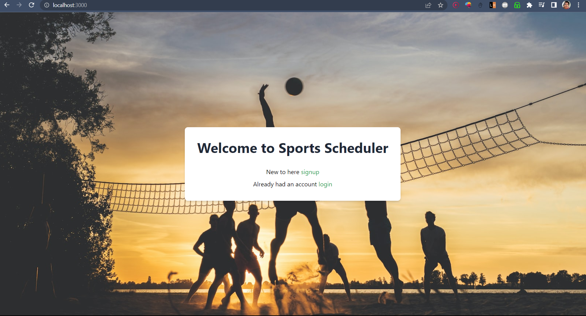
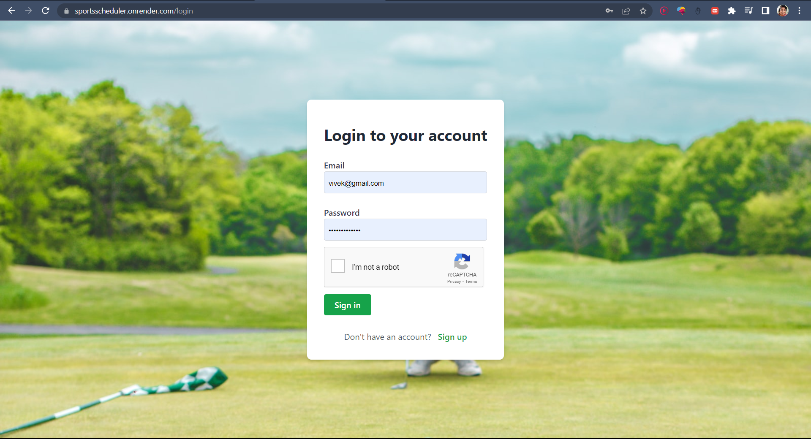
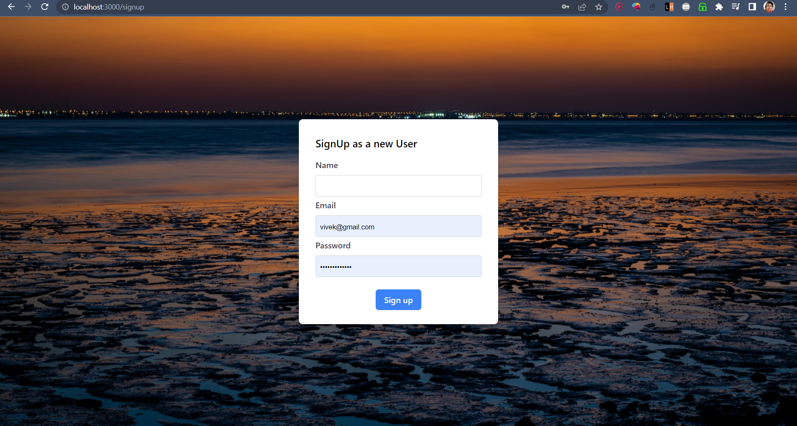
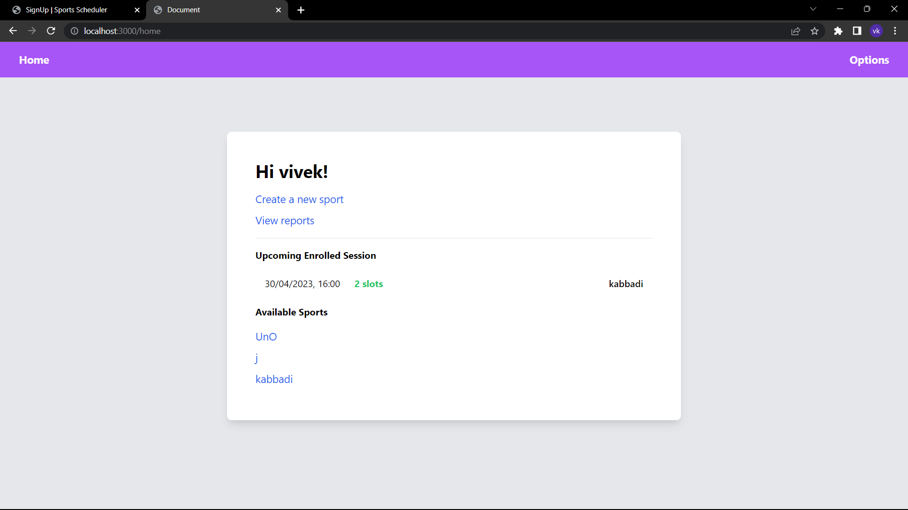
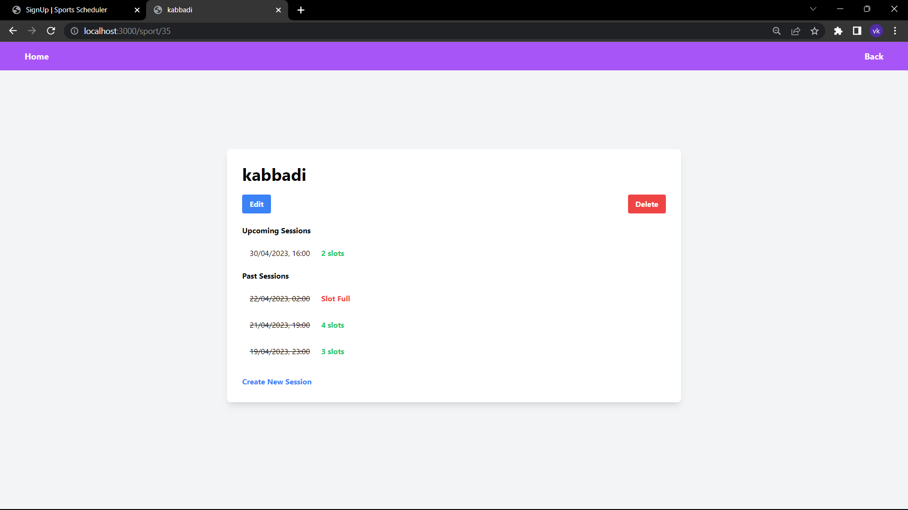
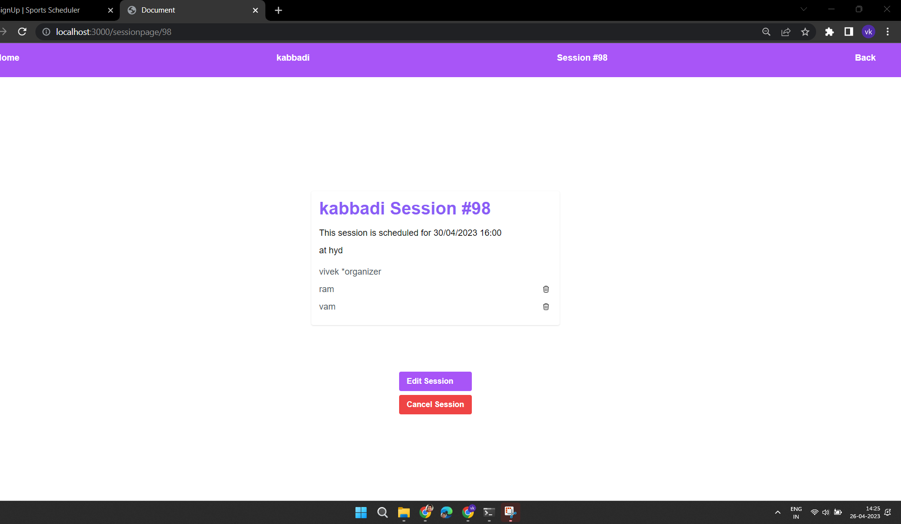

# SportsScheduler 

This is the final capstone project for wd201 pupilfirst.

[Webiste Link](https://sportsscheduler.onrender.com/)

[Youtube Link](https://www.youtube.com/watch?v=0ED8XnhlHaM)

## Admin credentials
- vivek@gmail.com : vivekpassword
- wdcoach@gmail.com : pupilfirst
- testadmin@gmail.com : testadmin

## Index Page

## Login Page

## Sign up page

## Home Page

## Sport page

 
## Session page

   This project is a Sports Scheduler, a web application that allows admins to create and manage different sports that are available for scheduling, and for players to sign up, create, and join sport sessions. The application serves two personas, the Administrator and the Player, each with their own set of features. Admins can create and edit different sports available for scheduling, view reports of games played, and also create and join sport sessions just like regular players. Players, on the other hand, can sign up and sign in using their email address and password, create and join sport sessions, and cancel sessions they have created.

## Features
- The project is a full-stack web application built with Node.js, Express, and PostgreSQL.
- It follows the Model-View-Controller (MVC) architecture and includes features for both admins and players.
- It is secured against CSRF attacks using csrf tokens and includes user authentication and session management with Passport.js.
- Passwords are hashed with bcrypt for added security.
- The application has been deployed on the Render platform and includes features such as cookie parser, sequelize validations, and flash messages for an enhanced user experience. 

## Additional Features
- reCaptcha v2-tickbox for enhanced security
- Change password feature only for players.
- Players are warned or blocked from joining multiple sessions on the same date and time.

